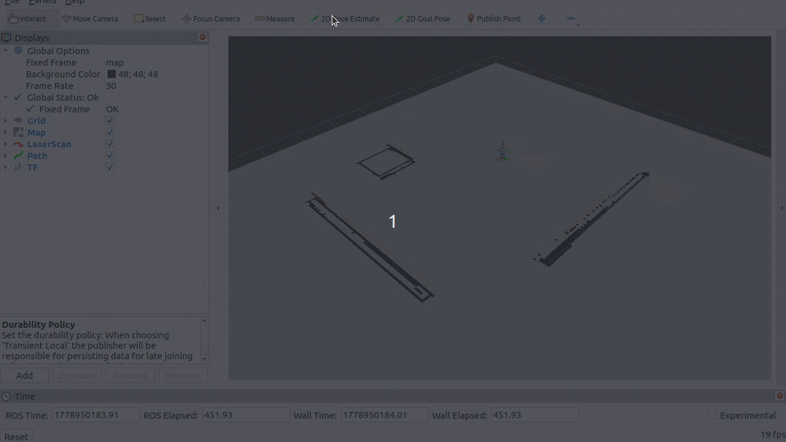
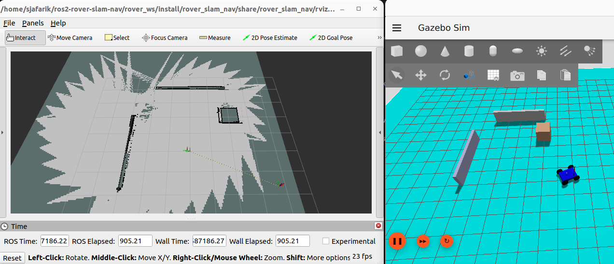

# ROS2 Rover SLAM and Navigation

A complete ROS2 Humble simulation project for a differential-drive rover performing 2D LiDAR SLAM, map saving, AMCL localization, and autonomous goal-based navigation using Nav2 in Gazebo Sim and RViz2.

This project demonstrates a full mobile robotics workflow:

1. Simulate a rover in Gazebo
2. Bridge Gazebo sensor data into ROS2
3. Fuse odometry and IMU using `robot_localization` EKF
4. Build a 2D occupancy map using SLAM Toolbox
5. Save the generated map
6. Reload the saved map with Nav2 Map Server
7. Localize the robot using AMCL
8. Navigate autonomously to a user-selected goal using Nav2

---

## Demo

### Nav2 Goal Navigation

The rover is localized in the saved map, a goal pose is selected in RViz2, Nav2 generates a path around the obstacle, and the rover follows the path in Gazebo.



### Initial SLAM Mapping Result

The map below was generated using LiDAR-based SLAM in RViz2 while slowly driving the rover around the environment.



---

## Project Overview

The project is divided into two main workflows:

### 1. Mapping Workflow

Used to create a map of the environment.

```text
Gazebo rover
  ↓
/scan, /imu, /model/rover_robot/odometry
  ↓
robot_localization EKF
  ↓
SLAM Toolbox
  ↓
/map
  ↓
map_saver_cli
  ↓
maps/slam_test_map.yaml + maps/slam_test_map.pgm
````

### 2. Navigation Workflow

Used after a map has been created and saved.

```text
Saved map
  ↓
Nav2 map_server
  ↓
AMCL localization
  ↓
Nav2 planner + controller
  ↓
/cmd_vel
  ↓
Gazebo rover moves to goal
```

---

## Main Features

* ROS2 Humble Python launch workflow
* Gazebo Sim rover simulation
* LiDAR, IMU, and odometry integration
* ROS-Gazebo bridge using `ros_gz_bridge`
* EKF sensor fusion using `robot_localization`
* Static TF setup for LiDAR and IMU frames
* SLAM Toolbox mapping
* RViz2 visualization for map, scan, TF, and path
* Saved map loading with Nav2 Map Server
* AMCL localization in a known map
* Nav2 path planning and goal following
* Obstacle-aware navigation around walls and objects

---

## Repository Structure

```text
rover_slam_nav/
├── config/
│   ├── ekf.yaml
│   ├── slam_toolbox.yaml
│   ├── amcl.yaml
│   └── nav2_params.yaml
│
├── launch/
│   ├── gazebo.launch.py
│   ├── robot.launch.py
│   └── navigation.launch.py
│
├── maps/
│   ├── slam_test_map.yaml
│   └── slam_test_map.pgm
│
├── models/
│   └── robot_rover/
│       └── model.sdf
│
├── rviz/
│   └── slam_mapping.rviz
│
├── worlds/
│   └── rover_robot_world.sdf
│
├── docs/
│   ├── goal_pose_motion_fast.gif
│   └── initial_mapping_preparation.png
│
├── package.xml
└── setup.py
```

---

## System Requirements

Tested with:

* Ubuntu 22.04
* ROS2 Humble
* Gazebo Sim / Gazebo Harmonic-compatible ROS-Gazebo bridge
* RViz2
* Nav2
* SLAM Toolbox
* robot_localization

Install required packages:

```bash
sudo apt update

sudo apt install \
  ros-humble-slam-toolbox \
  ros-humble-robot-localization \
  ros-humble-navigation2 \
  ros-humble-nav2-bringup \
  ros-humble-nav2-map-server \
  ros-humble-ros-gz-bridge \
  ros-humble-tf2-ros \
  ros-humble-rviz2 \
  ros-humble-teleop-twist-keyboard
```

---

## Build Instructions

From the workspace root:

```bash
cd ~/ros2-rover-slam-nav/rover_ws
colcon build --packages-select rover_slam_nav
```

Source the workspace:

```bash
source /opt/ros/humble/setup.bash
source install/setup.bash
```

Important: use a clean terminal and avoid sourcing unrelated ROS2 workspaces at the same time.

---

# Workflow 1: Mapping with SLAM Toolbox

Use this workflow to create or update the map.

## Launch the mapping stack

```bash
cd ~/ros2-rover-slam-nav/rover_ws
source /opt/ros/humble/setup.bash
source install/setup.bash

ros2 launch rover_slam_nav gazebo.launch.py
```

This launches:

```text
Gazebo
ros_gz_bridge
robot_localization EKF
LiDAR static TF
IMU static TF
SLAM Toolbox
RViz2
```

RViz2 should show:

* `/map`
* `/scan`
* TF frames
* rover pose
* live SLAM map

---

## Optional: Drive with Keyboard Teleop

In another terminal:

```bash
source /opt/ros/humble/setup.bash
source ~/ros2-rover-slam-nav/rover_ws/install/setup.bash

ros2 run teleop_twist_keyboard teleop_twist_keyboard
```

Drive slowly for best mapping quality.

Recommended behavior:

```text
slow forward motion
slow turns
avoid fast spin-in-place
```

Fast turning can reduce map quality because wheel odometry and simulated skid behavior may introduce small pose errors.

---

## Save the Map

After the map looks good in RViz2:

```bash
cd ~/ros2-rover-slam-nav/rover_ws/src/rover_slam_nav/maps
source ~/ros2-rover-slam-nav/rover_ws/install/setup.bash

ros2 run nav2_map_server map_saver_cli -f slam_test_map
```

This creates or overwrites:

```text
slam_test_map.yaml
slam_test_map.pgm
```

Rebuild so the saved map is installed into the package share directory:

```bash
cd ~/ros2-rover-slam-nav/rover_ws
colcon build --packages-select rover_slam_nav
source install/setup.bash
```

---

# Workflow 2: Navigation with Saved Map

Use this workflow after a map has been saved.

Navigation is split into two launch files:

```text
robot.launch.py       → robot simulation, bridge, EKF, static TFs
navigation.launch.py  → map server, AMCL, Nav2 planner/controller
```

---

## Terminal 1: Launch the Robot Stack

```bash
cd ~/ros2-rover-slam-nav/rover_ws
source /opt/ros/humble/setup.bash
source install/setup.bash

ros2 launch rover_slam_nav robot.launch.py
```

This starts:

```text
Gazebo
ros_gz_bridge
EKF
LiDAR static TF
IMU static TF
```

---

## Terminal 2: Launch Navigation Stack

```bash
cd ~/ros2-rover-slam-nav/rover_ws
source /opt/ros/humble/setup.bash
source install/setup.bash

ros2 launch rover_slam_nav navigation.launch.py
```

This starts:

```text
map_server
AMCL
planner_server
controller_server
bt_navigator
behavior_server
lifecycle_manager
global_costmap
local_costmap
```

A successful startup should include:

```text
Managed nodes are active
```

You can verify:

```bash
ros2 lifecycle get /bt_navigator
```

Expected:

```text
active [3]
```

---

## Terminal 3: Open RViz2

```bash
source /opt/ros/humble/setup.bash
source ~/ros2-rover-slam-nav/rover_ws/install/setup.bash

rviz2
```

In RViz2:

Set:

```text
Fixed Frame: map
```

Add displays:

```text
Map        → /map
LaserScan  → /scan
TF
Path       → /plan
```

For the Map display, set:

```text
Durability Policy: Transient Local
```

This is required because `map_server` publishes the saved map using transient-local QoS.

---

## Set Initial Pose

In RViz2, select:

```text
2D Pose Estimate
```

Click the robot’s approximate location on the map and drag the arrow in the direction the robot is facing.

This initializes AMCL localization.

You can verify the TF chain:

```bash
ros2 run tf2_ros tf2_echo map rover_robot/body
```

---

## Send a Navigation Goal

In RViz2, select:

```text
2D Goal Pose
```

or the available Nav2 goal tool.

Click a reachable location on the map and drag the arrow to set the desired final orientation.

Nav2 should:

```text
1. compute a global path
2. publish the path in RViz2
3. send velocity commands on /cmd_vel
4. move the rover in Gazebo
```

You can check velocity commands:

```bash
ros2 topic echo /cmd_vel --once
```

---

## Important TF Tree

The navigation stack depends on this TF chain:

```text
map
  ↓
rover_robot/odom
  ↓
rover_robot/body
  ↓
rover_robot/lidar_link/lidar_sensor
```

Main publishers:

```text
AMCL                    → map → rover_robot/odom
robot_localization EKF  → rover_robot/odom → rover_robot/body
static TF publisher     → rover_robot/body → LiDAR / IMU frames
```

---

## EKF Notes

The rover uses `robot_localization` to fuse odometry and IMU.

Final EKF logic:

```text
Odometry:
  use forward velocity

IMU:
  use yaw and yaw rate
```

This was important because raw simulated odometry yaw had noticeable error during turning. IMU yaw was more accurate, so the EKF configuration was adjusted to trust IMU heading more than raw odometry yaw.

The EKF publishes:

```text
/odometry/filtered
```

and the TF:

```text
rover_robot/odom → rover_robot/body
```

---

## SLAM Notes

SLAM Toolbox uses:

```text
/scan
TF tree
rover_robot/odom
rover_robot/body
```

to generate:

```text
/map
```

During mapping, slow motion gives better results. Fast turning can create map distortion because skid-steer-style turning introduces small simulation/odometry errors.

---

## Nav2 Notes

Nav2 uses:

```text
/map
AMCL pose
/scan
/odometry/filtered
TF tree
```

to compute paths and control the rover.

Main Nav2 components used:

```text
map_server
amcl
planner_server
controller_server
bt_navigator
behavior_server
global_costmap
local_costmap
```

The controller used is:

```text
Regulated Pure Pursuit Controller
```

The global planner used is:

```text
NavFn Planner
```

---

## Common Debug Commands

Check topics:

```bash
ros2 topic list
```

Check actions:

```bash
ros2 action list
```

Check Nav2 action:

```bash
ros2 action info /navigate_to_pose
```

Check EKF output:

```bash
ros2 topic echo /odometry/filtered --once
```

Check map:

```bash
ros2 topic echo /map --once --qos-reliability reliable --qos-durability transient_local
```

Check TF:

```bash
ros2 run tf2_ros tf2_echo rover_robot/odom rover_robot/body
ros2 run tf2_ros tf2_echo map rover_robot/body
ros2 run tf2_ros tf2_echo rover_robot/body rover_robot/lidar_link/lidar_sensor
```

Check Nav2 lifecycle:

```bash
ros2 lifecycle get /bt_navigator
ros2 lifecycle get /planner_server
ros2 lifecycle get /controller_server
```

Expected:

```text
active [3]
```

---

## Troubleshooting

### Map does not appear in RViz2

Set the Map display QoS:

```text
Durability Policy: Transient Local
```

### Nav2 goal is rejected

Check if BT Navigator is active:

```bash
ros2 lifecycle get /bt_navigator
```

Expected:

```text
active [3]
```

### `/bt_navigator` or Nav2 actions do not appear

Make sure you are using a clean terminal and source only the correct workspace:

```bash
source /opt/ros/humble/setup.bash
source ~/ros2-rover-slam-nav/rover_ws/install/setup.bash
```

Avoid sourcing unrelated ROS2 workspaces in the same terminal.

### TF errors after restarting Gazebo

Stop all launches and restart cleanly.

Do not restart Gazebo while Nav2 is still running, because simulation time can jump backward and clear TF buffers.

---

## Current Status

Completed:

* Gazebo rover simulation
* Sensor bridging
* EKF odometry filtering
* Static TFs for LiDAR and IMU
* SLAM Toolbox mapping
* Map saving
* Saved map loading
* AMCL localization
* Nav2 global planning
* Nav2 local control
* Goal-based navigation around obstacles

The rover can now localize in a saved map, plan a path around obstacles, and drive to a selected goal in simulation.

---

## Future Improvements

Possible next steps:

* Add a single combined launch file for full navigation
* Add parameterized map selection
* Add autonomous exploration
* Improve rover contact/friction model
* Add costmap visualization to RViz config
* Add launch arguments for mapping vs navigation mode
* Tune Nav2 controller for faster and smoother motion
* Add GitHub Actions or setup script for dependency installation
